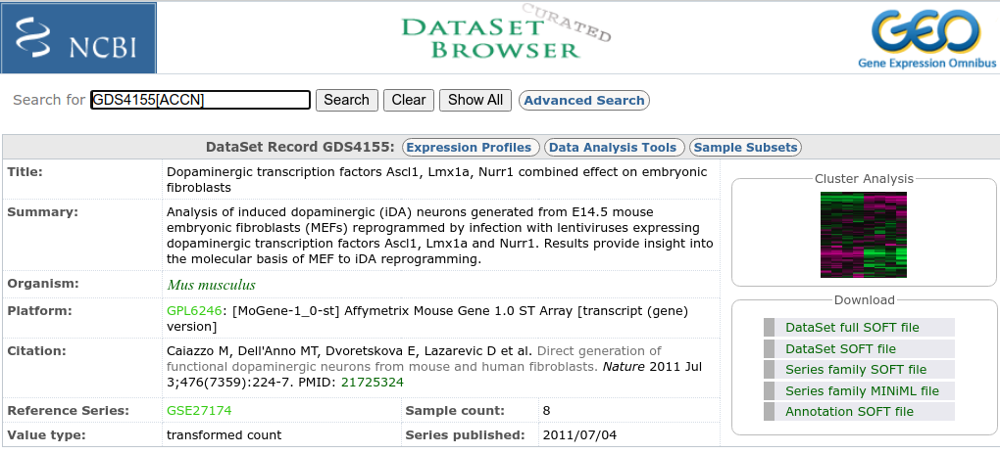

```{r include=FALSE}
require(knitr)
opts_chunk$set(
concordance=FALSE, echo=TRUE,  warning=FALSE, error=FALSE, message=FALSE)
```

# Introduction

This document is intended as a short introduction to managing microarray data using `R` for people who are new to either microarrays, `R` or both.

The document is written followin open source reproducibility principles. The code to re-crete it is available from github at: [https://github.com/ASPteaching/Analisis_de_datos_omicos-Ejemplo_0-Microarrays](https://github.com/ASPteaching/Analisis_de_datos_omicos-Ejemplo_0-Microarrays).

Although most people working with microarrays and `R` use the open source collection of packages compiled in `Bioconductor` no specific libraries will be used in this introduction. This is not the way you will proceed later in the course we start this way to emphasize that, in fact, omics data are *just* another type of data.

## About the Gene Expression Omnibus (GEO) database

The data for this example is obtained from the GEO database. Although its use is relatively straightforward, one thing that can be confusing is the distinct types of identifiers that characterize a given study. In order to make it clear from the beginning we start with a quick review of what is stored in the GEO database.

The NCBI Gene Expression Omnibus (GEO) serves as a public repository for a wide range of high-throughput experimental data. These data include single and dual channel microarray-based experiments measuring mRNA, genomic DNA, and protein abundance, as well as non-array techniques such as serial analysis of gene expression (SAGE), mass spectrometry proteomic data, and high-throughput sequencing data.

At the most basic level of organization of GEO, there are four basic
entity types. The first three (Sample, Platform, and Series) are
supplied by users; the fourth, the dataset, is compiled and curated by
GEO staff from the user-submitted data. More information is available in
the [GEO site](https://www.ncbi.nlm.nih.gov/geo/info/overview.html)
summarized by the image below:


There are five distinct type of entities at GEO:

Three of these are submitted by the data supppliers

-   **Plattforms**: Describe the the system used to generate the data.
    Each identifier corresponds to a commercial plattform such as
    Assymetrix, HGU133 plus 2 or Roche 454 sequencer. etc. Each platform
    has a unique accession number (GPLxxx).
-   **Samples**: Information about each individual sample. Each platform
    has a unique accession number (GSMxxx).
-   **Series**: A series links together a group of related samples and
    provides a focal point and description of the whole study. Each
    Series record is assigned a unique and stable GEO accession number
    (GSExxx).

The remaining two are elaborated by GEO.

-   **Dataset** A DataSet represents a curated collection of
    biologically and statistically comparable GEO Samples *and forms the
    basis of GEO's suite of data display and analysis tools*.
-   **Profiles** A Profile consists of the expression measurements for
    an individual gene across all Samples in a DataSet.

Each type of entity has one identifier associated, so that the
identifers for a given study are all related. The simplest way to obtain
an overview of a study is to start by the Dataset Accession page:
<https://www.ncbi.nlm.nih.gov/sites/GDSbrowser?acc=GDS4155>



It can be seen how this study has:

-   Dataset accesion ID for : GDS4155

-   Series accesion ID for : GSE27174

-   Plattform accession ID : GPL6246

Although, indeed, it seems more reasonable to start from the DATASET
page, it is very common that a give DataSet is associated with only one
series. In those cases it is common practice to start from the Series
page, which contains more information about the specific study. This is
what is done in the example below.

# A first look at microarray data. The study

In this exercise we will explore a dataset that was produced to
investigate the effect of inducing dopaminergic neurons in mice
fibroblast. The study has been published by Cui et alt. (@Cui:2006) and
uploaded to the Gene Expression Omnibus database with identifiers: -
[GDS4155](https://www.ncbi.nlm.nih.gov/sites/GDSbrowser?acc=GDS4155)
(Dataset) and -
[GSE27174](https://www.ncbi.nlm.nih.gov/geo/query/acc.cgi?acc=GSE27174)

This database allows uploading raw data but also pre-processed datasets
in the form of "data matrix". The data matrix for this study is
available at the link shown below and it can be downloaded directly from
there.

-   [GSE27174_series_matrix.txt](https://ftp.ncbi.nlm.nih.gov/geo/series/GSE27nnn/GSE27174/matrix/)

The file is in linux compressed format ".gz" that need to be
uncompressed before having access to the .txt file.

In the following we assume that you have downloaded the file and
unzipped it in a sub-folder of your working directory named "data"
pending from your working directory.

## Downloading the data and loading it into R

The data matrix recovered from the web contains some general information
first and the expression values for each sample after line 66.

The first thing to do is to separate both informations. This can be done
using the `read.table()` command using the `skip` option:

-   In a first iteration we read the first 70 lines
-   In the second on we skip the unnecessary 63 lines and read the
    expression matrix. Notic that the last line of the expression matrix
    contains a message "!series_matrix_table_end". This line has to be
    ommitted when reading the file! The easiest way to do it is to
    remove it from the file using a text editor but you can think of
    smarter ways.

```{r readData}
info <-readLines("data/GSE27174_series_matrix.txt", n=70)
x <-read.table("data/GSE27174_series_matrix.txt", skip=65, header=TRUE, sep="\t",row.names=1)
```

In order to understand the structure of the data we can proceed in two
ways:

-   Either inpect the header of the data matrix
-   Or look for this information in the GEO web site.

Opening the data matrix we realize that line 38 contains the following
information:

```{r}
info[30]
```

An inspection of the information available either in the matrix or in
the web shows that there are two type of samples "Induced" and "not
induced". *We can re-label the columns of the data matrix* to work more
fluently.

```{r relabelX}
colnames(x)
colnames(x) <- paste(c(rep("DopaminInduc", 4), rep("NotInduced", 4)), c("01", "02", "03","04"), sep="")
colnames(x)
```

## Obtain the annotations

Each row in the array represents one *probeset* which, roughly,
corresponds to one gene. In order to know to which gene each probeset is
associated one needs to know what array type is using and to have the
corresponding annotations table available.

The array type for this problem is `hgu133A` whose information is
available in GEO as plattform `GPL6246`:
<https://www.ncbi.nlm.nih.gov/geo/query/acc.cgi?acc=GPL6246>which
corresponds to the array type: MoGene-1_0-st, *Affymetrix Mouse Gene 1.0
ST Array transcript (gene) version*.

An annotation table can be downloaded from this site and read into `R`
to relate the probesets and their annotations. Again, this is a
rudimentary way to proceed. In later exercises we will show a more
efficient way to proceed using Bioconductor.

The file can be downloaded from the we page pressing the button
"Download full table ..." at the bottom of the page.

After downloading, we have the file \`GPL6246-18741.txt\` and can "look
at it" by reading the first lines to have a feeling of how these
annotations look like.

WARNING! This is a big file which may cause memory problems!

```{r readAnots}
infoAnots <-readLines("data/GPL6246-18741.txt", n=26) 
annot <-read.delim2("data/GPL6246-18741.txt", comment.char="#")
dim(annot)
head(annot[1:5, c(1:4,10)])
colnames(annot)
rownames(annot)<-annot$ID
```

The expression matrix, the information about the groups (now in the
column nnames) and the annotations is all we need to start exploring the
dataset.

# Exploratory Data Analysis

## Univariate statistical analysis

Omics data are high throughput so it is complex to have a good overview
just "inspecting the data".

```{r dims, print=FALSE,echo=TRUE}
dim(x)      # Dimensions
names(x)    # Vector of strings to name the columns
```

A first glimpse of the dataset can be obtained using basic summary
statistics and basic plots.

```{r summarize, print=FALSE,echo=TRUE}
round(apply(x,2, summary))  # Column-wise summary statistics,3)
```

Histograms are useful but can only be applied on a sample at the time.

```{r histArray0}
opt <- par(mfrow=c(3,3))
for (i in 1:ncol(x))
  hist(x[,i], main = names(x)[i])
par(opt)
```

Or, a better option, boxplots which allow viewing all the samples at
once and provide hints about the convenience of doing some type of
preprocessing.

```{r boxplot1}
groupColors <- c(rep("red", 4), rep("blue", 4))
boxplot(x, col=groupColors, main="Expression values for\n 8 samples, two groups",
    xlab="Slides",
    ylab="Expression", las=2, cex.axis=0.7, cex.main=0.7)
```

There is a slight assynmetry that might be corrected by taking
logarithms

```{r boxplot2}
logX <- log2(x)
groupColors <- c(rep("red", 4), rep("blue", 4))
boxplot(logX, col=groupColors, main="log Expression values for\n 8 samples, two groups",
    xlab="Slides",
    ylab="logExpression", las=2, cex.axis=0.7, cex.main=0.7)
```

Taking logs only changes the assymetry so it is probably not needed so we decide not to go for it.

Indeed the values downloaded from GEO have usually been preprocessed so what we obtain is a reasonable result.

## Multivariate data visualization

A very useful plot is ibtained by computing "sample-wise" principal
components and plotting the first two components. It can be used to
detect unusual samples or batch effects.

First compute principal components and loadings.

```{r pca}
pcX<-prcomp(t(logX), scale=FALSE) # Ya se han escalado los datos
loads<- round(pcX$sdev^2/sum(pcX$sdev^2)*100,1)
```

Then plot the first two components.

```{r plotPCA}
xlab<-c(paste("PC1",loads[1],"%"))
ylab<-c(paste("PC2",loads[2],"%"))
plot(pcX$x[,1:2],xlab=xlab,ylab=ylab, col=groupColors, 
     main ="Principal components (PCA)")
names2plot<-paste0(substr(names(x),1,3), 1:4)

text(pcX$x[,1],pcX$x[,2],names2plot, pos=3, cex=.6)
```

Alternatively a hierarchichal clustering can be used to visualize any
expected (or discover an unexpected) grouping of the samples.

```{r codedendrogramcomputeHC}
colnames(x) <- names2plot
clust.euclid.average <- hclust(dist(t(x)),method="average")
plot(clust.euclid.average, hang=-1)
```

Both PCA and clustering show a clear grouping associated with treatment,
which is rather common, except if there are unexpected issues such as
problematic samples or batch effects.

## Exercises

This exercises are intended for people who is starting to work with
Bioconductor.

1.  Go to the website of the Gene Expression Omnibus and Look for a
    comparative experiment that uses a small number of arrays and try to
    understand how the information is organized.

2.  Download the expressions and the covariate information (both stored
    in the "Series Matrix File(s)"). Notice that **you need a ftp
    program such as filezilla to download the file**

3.  Reproduce the exploration using the dataset you have downloaded.
    Feel free to complement it with any additional plot or summary which
    you fiond interesting.


# Looking for differentially expressed genes

## Comparing the expression between groups

In this section we assume that the data have already been normalized, so
that we can proceed to compare them to see if there is differential
expression between two conditions.

There exist packages implementing different variations of tests of
differential expression as well as corrections for the multiple testing
problem. However, following the idea of this document we rely on simple
t-tests that we will iterate along the matrix.

First, we build

```{r ttestFunction, print=FALSE,echo=TRUE}
ttest=function(x){tt=t.test(x[1:4],x[5:8])
return(c(tt$statistic,
         tt$p.value,
         tt$estimate[1]-tt$estimate[2]))
       }
```

and call it using `apply` again:

```{r computettest}
ans <- apply(x,1,ttest)
ts <- ans[1,]
pvals<-ans[2,]
fc <-  ans[3,]
```

We can study the distribution ​of $t$ values obtained using a histogram
or a "qq-plot". In any case we must not forget that we are looking at
the distribution of the test statistics not to that of the data.
"qq-plot" of t-statistics can be used to suggest that there are
diferentially expressed genes, that is genes whose values are higher or
lower than expected by the null hypothesis of non-difference.

```{r histmeans,fig=T}
hist(ts, breaks=100)
```

## Calling genes *differentially expressed*

A gene is called "differentially expressed" if its expression is
*significantly different* between two conditions. Following standard
approaches of statistical testing (which, have been strongly criticized)
We can call a gene differentially expressed if its p-value is under a
given threshold.

Choosing the threshold is not trivial nor obvious, but to account for
the problem of multiplicity of tests two common strategies are

-   Adjusting the p-values
-   Using a p-value much smaller than usual, combined with a minimum
    fold change to emphasize the need to combine "statistical
    significance" with "biological significance".

```{r howManyGenes}
for (i in c(0.01, 0.001, 0.0001, 0.00001, 0.000001, 0.0000001))
  print(paste("genes with p-values smaller than", i, length(which(pvals < i))))
```

If we put the cutoff in 1e-06 35 we obtain 35 genes that are probably up
or down regulated between the two conditions.

### The volcano plot

A common way to visualize the results of a differential expression
analysis is to use a *volcano plot* which plots the "fold change" vs
"minus logarithm of the p-values".

```{r}
plot(fc, -log(pvals))
```

In this plot, the genes which are "outer" and "upper" are the candidates
for being differentially expressed.

# References

-   Clough, E., & Barrett, T. (2016). The Gene Expression Omnibus
    Database. In Methods in molecular biology (Clifton, N.J.) (Vol.
    1418, pp. 93--110). <https://doi.org/10.1007/978-1-4939-3578-9_5>

- Cui, Dapeng, K. J. Dougherty, DW Machacek, S. Hochman, and D. J Baro. 2006. “Divergence Between Motoneurons: Gene Expression Profiling Provides a Molecular Characterization of Functionally Discrete Somatic and Autonomic Motoneurons.” Physiol Genomics 24 (3): 276–89. https://doi.org/ 10.1152/physiolgenomics.00109.2005.


